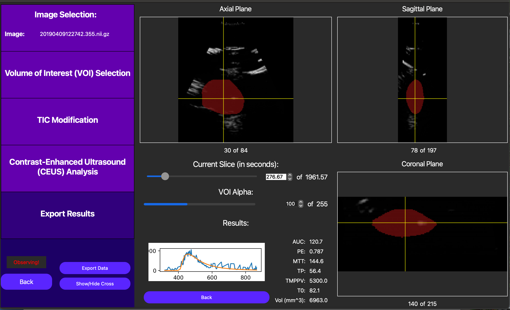

=====================
3D DCE-US GUI Example
=====================

Overview
========

This tutorial is a sample walkthrough of time intensity curve (TIC) analysis of a bolus injection captured in a 
3D dynamic contrast enhanced ultrasound (DCE-US) cine loop. This example uses the optional motion compensation 
feature on data stored in NIfTI format. For reference, the sample data used in this example can be found here.

Image Selection
===============

After opening the QuantUS GUI, we can begin by selecting `3D Dynamic Contrast-Enhanced Ultrasound (DCE-US)`
from the main menu. From here, we can select the `NIFTI` button to choose the appropriate parser for this set of analysis.
Once we input the B-Mode (optional) and DCE-US cine loops, we click `Generate Image` to parse the data.

After the ultrasound parser loads, the cine loops will be displayed in the main window, as shown below.

.. image:: 3dDceusLoaded.png
    :alt: Loaded Image
    :width: 750
    :align: center

|

Each 3D frame can be navigated by pressing the GUI so that the label that says `Observing!` above moves to navigating
and then scrolling around different locations of each axis. We recommend starting navigation with the yellow crosshair
enabled as shown above, but it may be useful to turn this off as well using the `Show/Hide Cross` button.

Volume of Interest Selection
============================

Following the analysis progression on the left side of the GUI, we now move to Volume of Interest (VOI) selection.
The VOI determines which segmentation of the inputted image we will use to compute the TIC in our analysis.

On the GUI, the `Draw New VOI` button enables us to draw a free-handed spline to define the VOI. This works by drawing at 
least one free-handed region of interest (ROI) in each axis, and then merging them together using the `Interpolate VOI`
button. 

Individual ROIs can also be fine-tuned using the `Advanced ROI Edit` button for the relevant axis. Note 
this feature is only accessible when this button is green instead of red. As shown below, in this feature, the user 
can drag points used to define the ROI to adjust the ROI itself dynamically.

.. image:: editRoi3dDceus.png
    :alt: Editing ROI on GUI
    :width: 750
    :align: center

|

Finally, once an original VOI has been drawn, the user can draw smaller VOIs within the original VOI to create holes
in the VOI, excluding regions of the image that are not relevant to the analysis.

Once we are satisfied with the VOI, it can be saved and reloaded during another analysis run using the  `Save VOI` and
`Load VOI` buttons. To compute the TIC on this VOI, we can click the `Continue` button, as shown below.

.. image:: drawnVoi3dDceus.png
    :alt: Completed VOI on GUI
    :width: 750
    :align: center

|

TIC Modification
================

On this screen, we start with the option of manually selecting a t0 for the TIC analysis, or automatically selecting
one later. In this context, t0 corresponds to the start point we use when we fit a lognormal curve to the TIC data to 
quantitatively model the bolus injection. In this case, we opt to automatically select t0 later, as this will be optimized
for us.

.. image:: ticPointsSelected3d.png
    :alt: TIC Modification
    :width: 750
    :align: center

|

In this case, since we don't have the option of motion compensation, we can eliminate points from the TIC to exclude
frames which most likely don't follow the underlying tissue we selected in the original VOI. This can be checked clicking
a point on the TIC plot in question, and then looking at the corresponding DCE-US frame in the cine loop above the TIC plot.
Below, notice how excluding noisy points can help us isolate the bolus injection in the TIC, significantly improving the quality
of our analysis.

.. image:: trimmedTic3d.png
    :alt: TIC Trimmed
    :width: 750
    :align: center

|

Finally, we can click the `Accept TIC` button to fit a lognormal curve to our modified TIC and view our results.

Analysis Results
================

After performing the lognormal curve fitting, the area under the curve (AUC), peak enhancement (PE), time to peak (TP),
mean transit-time (MTT), t0, and ROI area are displayed by pressing the `Show TIC` button in the new screen. A visual
of our curve fit is also displayed, as shown below.

Also, note an externally computed parametric map can be displayed using the `Load Parametric Map` button. This operation
is too computationally demanding to be included in this GUI, but externally computed maps will break the VOI into voxels
and run TIC analysis on each voxel to create a parametric map. Note the TIC for each of these voxels
must be unmodified, so this feature is best used for non-noisy data. This feature is useful for visualizing the spatial
relationships between the TIC parameters. For more resources to help with creating these maps, please reach out to our developers.

Finally, we can save the TIC parameters for the entire ROI into a CSV file by first pressing the `Export Data` button and then
linking a CSV file to our analysis runs, which can store data from multiple analyses.
A CLI is also currently under development to streamline this pipeline using batch processing.
