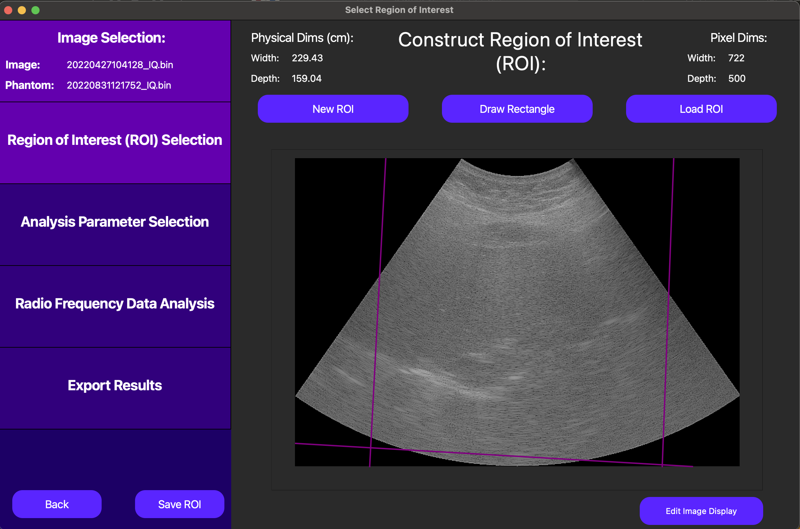
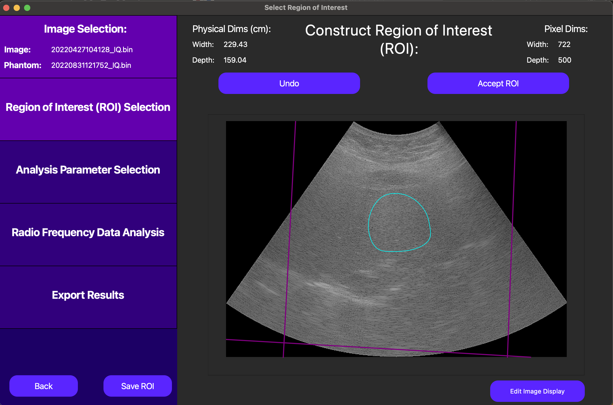
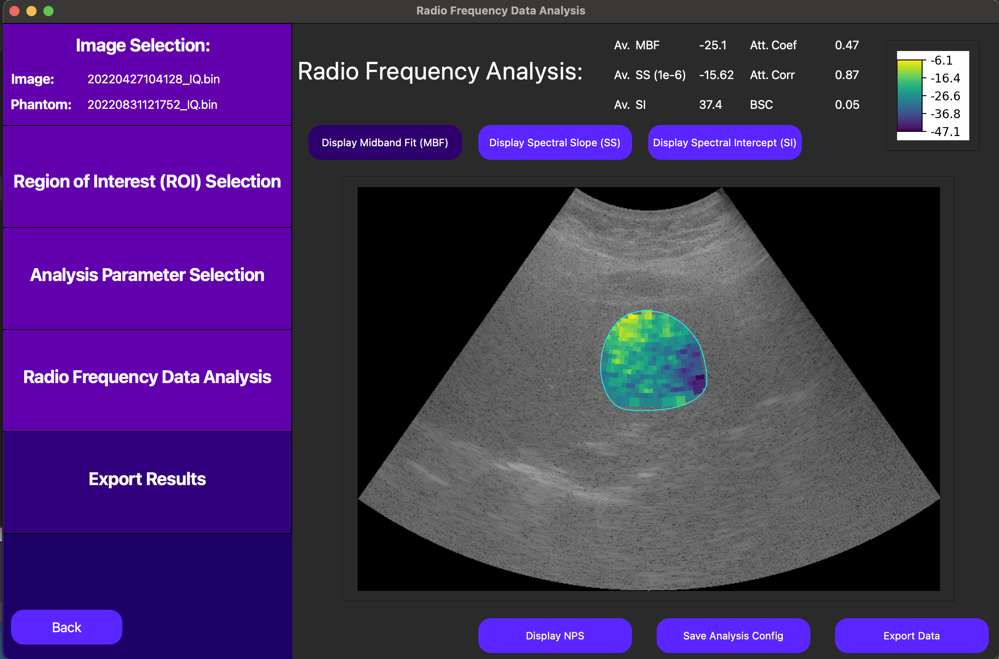

==================
2D QUS GUI Example
==================

Overview
========

This tutorial is a sample walkthrough of QUS parametrization of scan converted IQ data from a Canon system.
For reference, the sample data used in this example can be found here.

Image Selection
===============

After opening the QuantUS GUI, we can begin by selecting **Quantitative Ultrasound Spectroscopy (QUS)** from the main menu.
From here, we can select the **Canon IQ** button to choose the appropriate parser for this set of analysis.
Once inputting the image and phantom data file path, click **Generate Image** to parse the data.

After the ultrasound parser loads, the image will be displayed in the main window, as shown below.

|

On this screen, the purple lines on top of the B-Mode image representing the underlying RF data are unique to 
an experiment we are currently conducting using the Canon parser. For all other data formats, no such delineation
will be present.

Region of Interest Selection
============================

Following the analysis progression on the left side of the GUI, we now move to Region of Interest (ROI) selection.
The ROI determines which segmentation of the inputted image we will break into windows and run QUS parameterization on.

On the GUI, the `New ROI` button enables us to draw a free-handed spline to define the ROI. Alternatively, the 
`Draw Rectangle` button allows us to draw a rectangle by dragging our cursor to define the ROI, and the `Load ROI`
loads a pre-drawn ROI that has been saved externally.

|

Once the ROI has been defined (see above), we can click the `Save ROI` button to save the ROI for later use.

To advance to analysis parameter selection, click `Accept ROI`.

Analysis Parameters for QUS Parameterization
============================================

On this screen, we start with a default set of analysis parameters for QUS parameterization.
If need be, these can be customized to fit the specific needs of the experiment, and vary aspects
such as window size and analysis frequency bandwidth. Specifics about the definitions of each of these
parameters are located in the PyQuantUS API section of this documentation as well as the **2D QUS CLI Example**.
The interface for customizing these parameters is below.

.. image:: analysisParams.png
    :alt: Analysis Parameters
    :width: 750
    :align: center

|

For the purposes of this example, we will proceed with the default parameters by pressing `Continue`.

QUS Parameterization
====================

Finally, QuantUS performs QUS parameterization under the hood, and displays the results on the next page.
As shown below, the averages of each parameter across all windows are displayed at the top of the screen. 
Parametric maps for the midband fit (MBF), spectral slope (SS), and spectral intercept (SI) can be activated 
and deactivated using their corresponding buttons above the B-Mode image.

|

For more detailed information on the QUS parameterization process, we can also use the `Display NPS` button to 
show the normalized power spectrum (NPS) of each of the windows which contributed to our MBF, SS, and SI results.

.. image:: nps.png
    :alt: NPS Results
    :width: 750
    :align: center

|

In the above plot, the each dark blue line corresponds to an NPS for an individual window while the red line corresponds
to the average NPS across all windows. The orange line is the line of best fit of the average NPS for the given 
analysis frequency bandwidth as specified in our analysis parameters. Note that the slope, intercept, and median 
correspond to the SS, SI, and MBF respectively.

Finally, we can save the analysis parameters we used for this analysis as a single configuration in an external file
using the `Save Analysis Config` button. This will allow us to load these parameters in the future for similar analyses.

From here, it is possible to save the numerical values at the top of the GUI into a CSV file using the `Save Results` button.
However, for large sets of analysis, it is recommended for efficiency purposes to only use the GUI for drawing and saving ROIs
before using the CLI for batch processing.
